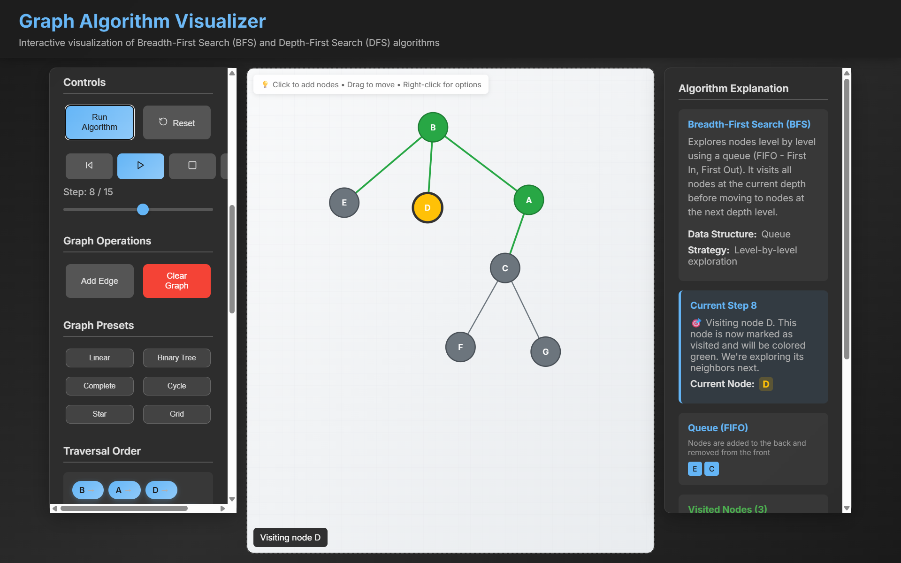
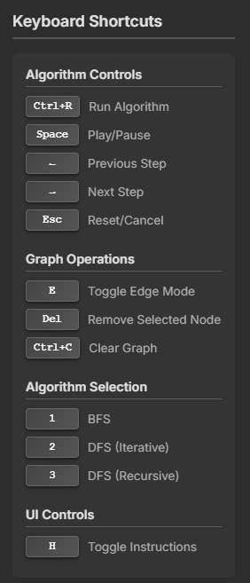
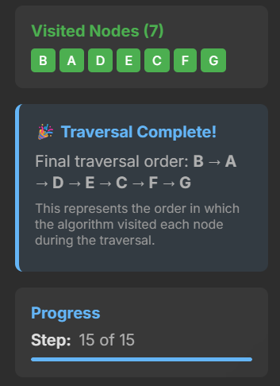
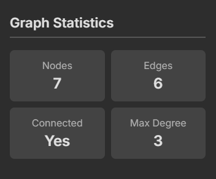
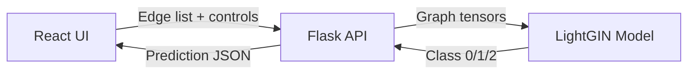

# NodeScape – Graph Algorithm Visualizer + Graph Type Predictor

NodeScape is a full-stack learning tool for graph algorithms. It combines an interactive React visualizer for BFS/DFS with a Python Flask + TensorFlow backend that predicts graph types (Tree, Cycle, DAG) from edge lists.



## What you can do

**For beginners**
- Draw your own graphs by clicking on the canvas.
- Run BFS or DFS step-by-step with play/pause controls.
- See queue/stack state, visited order, and live graph stats.
- Use presets (linear, tree, cycle, star, grid) to learn faster.

**For developers**
- Explore a modern React UI with SVG-based rendering.
- Call a REST API that runs a Graph Neural Network (LightGIN).
- Deploy everything with Docker Compose or use CI/CD workflows.

## Visual tour

| Feature | Preview |
| --- | --- |
| Keyboard shortcuts |  |
| Traversal order |  |
| Graph statistics |  |

## Quick start (beginner-friendly)

### Option A: Full stack with Docker (recommended)

```bash
docker-compose up --build
```

Open the app at `http://localhost:3000`. The backend runs on `http://localhost:5000`.

### Option B: Local dev without Docker

**Backend**
```bash
cd backend
python -m pip install -r requirements.txt
python app.py
```

**Frontend**
```bash
cd frontend
npm install
npm start
```

### Quick API check

```bash
node test-api.js
```

## How to use the app (absolute beginner)

1. **Add nodes**: Click anywhere on the canvas.
2. **Connect nodes**: Toggle “Add Edge” mode, then click two nodes.
3. **Pick an algorithm**: BFS, DFS (iterative), or DFS (recursive).
4. **Run**: Click **Run Algorithm** or press **Ctrl+R**.
5. **Predict graph type**: Use the prediction button to see Tree/Cycle/DAG results.

## Architecture overview



## API (backend)

**Endpoint**
- `POST /predict`

**Request body**
```json
{ "edgelist": "[[0,1],[1,2],[2,3]]" }
```

**Response**
```json
{ "prediction": 2 }
```

Prediction mapping (from the UI):
- `0` → Tree
- `1` → Cycle
- `2` → DAG

## Deep dive (for developers)

### Key frontend areas
- `frontend/src/components/GraphVisualization.js`: SVG graph rendering + interactions.
- `frontend/src/utils/graphAlgorithms.js`: BFS/DFS implementations with step tracking.
- `frontend/src/api/predict.js`: Backend integration for graph-type prediction.

### Key backend areas
- `backend/app.py`: Flask API, `/predict` endpoint.
- `backend/model.py`: LightGIN model definition + preprocessing.
  - Features: node degree + clustering coefficient.
  - Input: edge list string converted to adjacency and node features.

### Project structure
```
NodeScape-Low_Bias_High_Variance/
├── backend/               # Flask + TensorFlow API
├── frontend/              # React visualizer
├── docker-compose.yml     # Full stack prod compose
├── docker-compose.dev.yml # Full stack dev compose
├── test-api.js            # Quick API check
└── .github/workflows/     # CI/CD pipeline
```

### Scripts and tooling
**Frontend**
- `npm start` – dev server
- `npm test -- --watchAll=false` – tests
- `npm run build` – production build

**Backend**
- `python app.py` – run Flask server

**Docker**
- `docker-compose up --build` – full stack
- `docker-compose -f docker-compose.dev.yml up --build` – dev stack

### CI/CD highlights
The workflow runs on `main` and `dev`, detects frontend/backend changes, runs tests, builds images, and pushes to Docker Hub.

## Configuration

| Variable | Location | Purpose | Default |
| --- | --- | --- | --- |
| `REACT_APP_API_URL` | Frontend | Backend base URL in dev | `http://localhost:5000` |
| `FLASK_ENV` | Backend | Flask environment | `production` |
| `FLASK_APP` | Backend | Flask entry point | `app.py` |

## Troubleshooting

- **No prediction result**: Ensure backend is running and reachable at `REACT_APP_API_URL`.
- **Port conflicts**: Check if ports `3000` or `5000` are already in use.
- **Model load failures**: Confirm `backend/lightgin_model_weights.h5` exists.

## License

This project is for educational use. See individual files for details.
