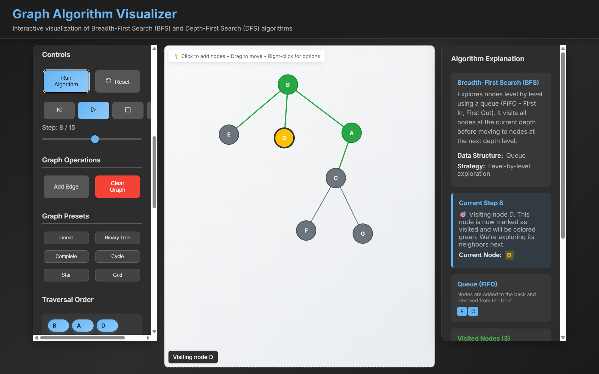
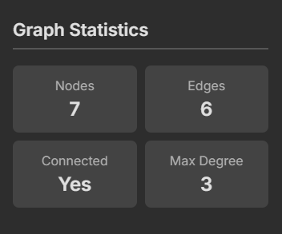

# Graph Algorithm Visualizer - BFS & DFS

An interactive React application that visualizes Breadth-First Search (BFS) and Depth-First Search (DFS) algorithms on user-defined graphs.




### Keyboard Shortcuts


The application includes comprehensive keyboard shortcuts for faster operation:

#### Algorithm Controls
- **Ctrl+R**: Run the selected algorithm
- **Space**: Play/Pause algorithm playback
- **← (Left Arrow)**: Previous step
- **→ (Right Arrow)**: Next step
- **Esc**: Reset visualization and cancel current operations

#### Graph Operations
- **E**: Toggle edge creation mode
- **Delete/Backspace**: Remove selected node
- **Ctrl+C**: Clear entire graph

#### Algorithm Selection
- **1**: Select BFS algorithm
- **2**: Select DFS (Iterative) algorithm
- **3**: Select DFS (Recursive) algorithm

#### UI Controls
- **H**: Toggle instructions visibility

*Note: Keyboard shortcuts are disabled when typing in input fields.*


### Graph Traversal Order Upon Completion


### Graph Statistics


### Real Time Information


## 🌟 Features

### Core Functionality
- **Interactive Graph Creation**: Click to add nodes, drag to move them, use edge mode to connect nodes
- **Multiple Algorithms**: 
  - Breadth-First Search (BFS) with queue visualization
  - Depth-First Search (DFS) - Iterative with stack visualization
  - Depth-First Search (DFS) - Recursive with call stack visualization
- **Step-by-Step Visualization**: Watch algorithms execute step by step with detailed explanations
- **Playback Controls**: Play, pause, step forward/backward, speed control, and timeline scrubbing

### Graph Manipulation
- **Add/Remove Nodes**: Click empty space to add nodes, right-click to delete
- **Add/Remove Edges**: Toggle edge mode to connect nodes, right-click edges to delete
- **Drag & Drop**: Drag nodes to reposition them for better visualization
- **Graph Presets**: Quick access to common graph structures (binary tree, complete graph, cycle, etc.)

### Visualization Features
- **Real-time State Display**: See current node, visited nodes, queue/stack contents
- **Color-coded Nodes**: Different colors for unvisited, current, and visited nodes
- **Edge Highlighting**: Traversed edges are highlighted during algorithm execution
- **Algorithm Information**: Detailed descriptions, time/space complexity information

### User Experience
- **Responsive Design**: Works on desktop and mobile devices
- **Modern UI**: Clean, gradient-based design with smooth animations
- **Interactive Help**: Built-in instructions and tooltips
- **Graph Statistics**: Real-time statistics about your graph (nodes, edges, connectivity)

## 🚀 Quick Start

### Prerequisites
- Node.js (version 14.0.0 or higher)
- npm (version 6.0.0 or higher)
- Docker (for containerized deployment)

### Local Development

1. **Clone or Download the Project**
   ```bash
   # If you have the project as a zip file, extract it
   # If you have access to a git repository:
   git clone <repository-url>
   cd NodeScape-Low_Bias_High_Variance
   ```

2. **Install Dependencies**
   ```bash
   npm install
   ```

3. **Start the Development Server**
   ```bash
   npm start
   ```

4. **Open in Browser**
   The application will automatically open in your default browser at `http://localhost:3000`

### Docker Deployment

#### Option 1: Using Docker Compose (Recommended)
```bash
# Build and run with Docker Compose
docker-compose up --build

# Access the application at http://localhost:3000
```

#### Option 2: Using Docker directly
```bash
# Build the Docker image
docker build -t nodescape-graph-visualizer .

# Run the container
docker run -d -p 3000:80 --name nodescape-app nodescape-graph-visualizer

# Access the application at http://localhost:3000
```

#### Option 3: Using the deployment script
```bash
# Make the script executable (first time only)
chmod +x scripts/deploy.sh

# Run the deployment script
./scripts/deploy.sh                    # Build and run locally
./scripts/deploy.sh --remote           # Use latest remote image
IMAGE_TAG=1.0.5 ./scripts/deploy.sh   # Use specific version
```

### Building for Production

To create a production build:
```bash
npm run build
```

The build folder will contain optimized files ready for deployment.

## 🐳 Docker & CI/CD

### Docker Image

The application is containerized using a multi-stage Docker build:
- **Build Stage**: Uses Node.js 18 Alpine to build the React application
- **Production Stage**: Uses Nginx Alpine to serve the static files

### CI/CD Pipeline

The project includes GitHub Actions for automated CI/CD with dynamic versioning:

1. **Testing**: Runs on every push and pull request
   - Installs dependencies
   - Runs tests
   - Builds the application

2. **Deployment**: Runs on main/dev branch pushes
   - Builds Docker image with dynamic versioning
   - Pushes to Docker Hub with multiple tags
   - Uses GitHub Actions cache for faster builds

### Dynamic Versioning

The CI/CD pipeline automatically generates version numbers based on:
- **Branch**: Determines the major version prefix
- **Run Number**: GitHub Actions run number for the build number

**Version Format**:
- `main` branch: `1.0.{run_number}` (e.g., 1.0.5)
- `dev` branch: `0.1.{run_number}` (e.g., 0.1.3)
- Other branches: `0.0.{run_number}` (e.g., 0.0.2)

**Tags Created**:
- Version tag: `asifmahmoud414/nodescape-graph-visualizer:1.0.5`
- Latest tag: `asifmahmoud414/nodescape-graph-visualizer:latest` (main branch)
- Dev tag: `asifmahmoud414/nodescape-graph-visualizer:dev` (dev branch)

### Docker Hub Deployment

To set up automatic deployment to Docker Hub:

1. **Create Docker Hub Account**: Sign up at [Docker Hub](https://hub.docker.com)

2. **Create Access Token**: 
   - Go to Account Settings → Security
   - Create a new access token

3. **Add GitHub Secrets**:
   - Go to your GitHub repository → Settings → Secrets and variables → Actions
   - Add the following secrets:
     - `DOCKERHUB_USERNAME`: Your Docker Hub username
     - `DOCKERHUB_TOKEN`: Your Docker Hub access token

4. **Push to Main Branch**: The CI/CD pipeline will automatically:
   - Build the Docker image
   - Push to `your-username/nodescape-graph-visualizer:latest`

### Pulling from Docker Hub

Once the image is pushed to Docker Hub, anyone can run it:

```bash
# Pull and run the latest image
docker run -d -p 3000:80 asifmahmoud414/nodescape-graph-visualizer:latest

# Run a specific version
docker run -d -p 3000:80 asifmahmoud414/nodescape-graph-visualizer:1.0.5

# Run dev version
docker run -d -p 3000:80 asifmahmoud414/nodescape-graph-visualizer:dev

# Or use docker-compose with the remote image
docker-compose -f docker-compose.prod.yml up -d

# Use specific version with environment variables
IMAGE_TAG=1.0.5 docker-compose -f docker-compose.prod.yml up -d
```

## 📖 How to Use

### Creating Your First Graph

1. **Add Nodes**: Click anywhere on the empty canvas to add nodes (labeled A, B, C, etc.)
2. **Connect Nodes**: 
   - Click the "Add Edge" button in the control panel
   - Click on the first node, then click on the second node to create an edge
   - Click "Cancel Edge" to exit edge creation mode
3. **Reposition Nodes**: Drag any node to move it around the canvas

### Running Algorithms

1. **Select Algorithm**: Choose from BFS, DFS (Iterative), or DFS (Recursive) in the dropdown
2. **Choose Start Node**: Select which node to start the traversal from
3. **Run Algorithm**: Click "Run Algorithm" to generate the step-by-step visualization
4. **Control Playback**:
   - ▶️ **Play/Pause**: Start or pause automatic playback
   - ⏹️ **Stop**: Reset to the beginning
   - ⏮️/⏭️ **Step**: Move one step backward or forward
   - **Slider**: Jump to any specific step
   - **Speed Control**: Adjust animation speed (100ms to 2000ms per step)

### Graph Presets

Try different graph structures with one click:
- **Linear**: A simple chain of connected nodes (A-B-C-D-E)
- **Binary Tree**: A complete binary tree structure
- **Complete**: Every node connected to every other node
- **Cycle**: Nodes connected in a circular pattern
- **Star**: One central node connected to all others
- **Grid**: A 2D grid structure

### Advanced Features

- **Context Menus**: Right-click on nodes or edges for delete options
- **Graph Statistics**: Monitor nodes, edges, connectivity, and degree information
- **Algorithm State**: View real-time queue/stack contents and visited nodes
- **Node Selection**: Click nodes to see their degree and neighbor information
- **Traversal Order**: After algorithm completion, view the complete node traversal sequence
- **Persistent Node Positions**: Node positions are preserved when adding/removing nodes or edges

## 🎯 Algorithm Details

### Breadth-First Search (BFS)
- **Strategy**: Explores nodes level by level using a queue (FIFO)
- **Use Cases**: Shortest path in unweighted graphs, level-order traversal
- **Time Complexity**: O(V + E) where V = vertices, E = edges
- **Space Complexity**: O(V) for the queue and visited set

### Depth-First Search (DFS) - Iterative
- **Strategy**: Explores as far as possible along each branch using a stack (LIFO)
- **Use Cases**: Topological sorting, detecting cycles, pathfinding
- **Time Complexity**: O(V + E)
- **Space Complexity**: O(V) for the stack and visited set

### Depth-First Search (DFS) - Recursive
- **Strategy**: Uses function call stack for recursion
- **Use Cases**: Same as iterative DFS, educational purposes
- **Time Complexity**: O(V + E)
- **Space Complexity**: O(V) for recursion stack

## 🛠️ Technical Architecture

### Project Structure
```
src/
├── components/
│   ├── GraphVisualization.js    # SVG-based graph rendering
│   └── ControlPanel.js          # UI controls and algorithm info
├── utils/
│   ├── graph.js                 # Graph data structure
│   └── graphAlgorithms.js       # BFS/DFS implementations
├── styles/
│   └── index.css               # Global styles
├── App.js                      # Main application component
└── index.js                    # React entry point
```

### Key Technologies
- **React 18.2**: Modern React with hooks for state management
- **SVG Graphics**: Smooth, scalable vector graphics for visualization
- **CSS Grid & Flexbox**: Responsive layout system
- **Lucide React**: Beautiful, consistent icons
- **Custom Algorithms**: Hand-crafted BFS/DFS implementations with step tracking

## 🎨 Color Coding

- **Gray Nodes**: Unvisited nodes
- **Yellow Nodes**: Currently being processed
- **Green Nodes**: Visited/completed nodes
- **Blue Outline**: Selected node
- **Yellow Outline**: Edge creation mode
- **Green Edges**: Traversed during algorithm execution

## 📱 Responsive Design

The application is fully responsive and works on:
- **Desktop**: Full feature set with optimal layout
- **Tablets**: Adapted control panel layout
- **Mobile**: Stacked layout with touch-friendly controls

## 🔧 Customization

### Modifying Algorithms
Add new algorithms by:
1. Implementing the algorithm in `src/utils/graphAlgorithms.js`
2. Adding the algorithm option to the dropdown in `ControlPanel.js`
3. Including algorithm information in the `algorithmInfo` object

### Styling Changes
- Modify `src/styles/index.css` for global styles
- Adjust color scheme by changing CSS custom properties
- Modify node/edge styling in the GraphVisualization component

### Adding Graph Presets
Add new presets in `src/utils/graph.js` within the `GraphPresets` object.

## 🐛 Troubleshooting

### Common Issues

1. **Application won't start**
   - Ensure Node.js and npm are installed
   - Run `npm install` to install dependencies
   - Check for port conflicts (try a different port with `npm start -- --port 3001`)

2. **Nodes are not visible**
   - Try using a graph preset to load a sample graph
   - Click on empty canvas area to add nodes

3. **Algorithm doesn't run**
   - Ensure you have at least one node in the graph
   - Verify the start node exists in your graph
   - Check browser console for any error messages

4. **Performance issues with large graphs**
   - The visualizer is optimized for graphs with 10-20 nodes
   - For larger graphs, increase animation speed or use step-by-step mode

### Browser Compatibility
- **Recommended**: Chrome 90+, Firefox 88+, Safari 14+, Edge 90+
- **Minimum**: Any modern browser with ES6+ support

## 🤝 Contributing

This is an educational project. Feel free to:
- Add new algorithms (Dijkstra's, A*, etc.)
- Improve the UI/UX design
- Add graph import/export functionality
- Implement directed graph support
- Add more graph presets

## 📝 License

This project is created for educational purposes. Feel free to use and modify as needed.

## 🎓 Educational Value

This visualizer is perfect for:
- **Computer Science Students**: Understanding graph traversal algorithms
- **Teachers**: Demonstrating algorithm concepts visually
- **Self-learners**: Interactive way to learn data structures and algorithms
- **Interview Preparation**: Practicing graph algorithm concepts

---

**Enjoy exploring graph algorithms! 🚀**

For questions or issues, please check the troubleshooting section above or examine the browser console for error messages. 
